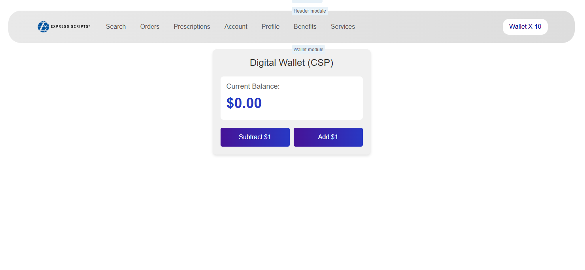

# Micro Frontend Prototype

This repository demonstrates a micro frontend architecture using UMD (Universal Module Definition) and Webpack technology. It consists of three main components: Main UI, Wallet UI, and Header UI.

## Technology Stack

- React 16
- Redux 7
- Webpack 4
- UMD (Universal Module Definition)

## Installation

1. Clone this repository:

   ```
   git clone https://github.com/your-username/mfe-prototype.git
   cd mfe-prototype
   ```

2. Install dependencies for the root project and all subprojects:

   You can either use the step-by-step method or the quick install command for your operating system.

   Step-by-step method:

   ```
   yarn install
   cd header-ui && yarn install
   cd ../main-ui && yarn install
   cd ../wallet-ui && yarn install
   cd ..
   ```

   Quick install commands:

   For Windows (CMD):

   ```cmd
   for %d in (header-ui main-ui wallet-ui .) do (cd %d && yarn install && cd ..)
   ```

   For Windows (PowerShell):

   ```powershell
   @("header-ui", "main-ui", "wallet-ui", ".") | ForEach-Object { Push-Location $_; yarn install; Pop-Location }
   ```

   For Mac/Linux (Bash):

   ```bash
   for dir in header-ui main-ui wallet-ui .; do (cd "$dir" && yarn install); done
   ```

   These quick install commands will navigate into each directory, run `yarn install`, and then return to the parent directory before moving to the next one.

## Running the Application

To start all three applications concurrently:

```
yarn start:all
```

This command will open three tabs in your default browser:

1. Main UI: http://localhost:3000 - The main application where you can see all modules integrated.
2. Wallet UI: http://localhost:3001 - This will be empty as it's just exporting the UMD module.
3. Header UI: http://localhost:3002 - This will be empty as it's just exporting the UMD module.

## Building the Application

To build all three applications:

```
yarn build:all
```

This will create production-ready builds for all three components.

## Project Structure

```
mfe-prototype/
├── header-ui/
├── main-ui/
├── wallet-ui/
└── package.json
```

## How it works

The Main UI application consumes the Wallet UI and Header UI as UMD modules. These modules export their React components, reducers, and actions, which are then integrated into the Main UI application.

## Application Preview

When you start the application using `yarn start:all`, you should see something like this in your Main UI tab (http://localhost:3000):



Note: The Wallet UI (localhost:3001) and Header UI (localhost:3002) tabs will be empty as they are just exporting UMD modules.
